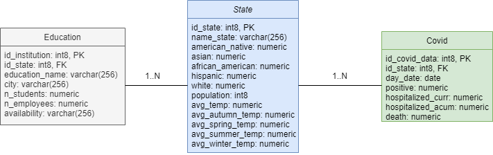
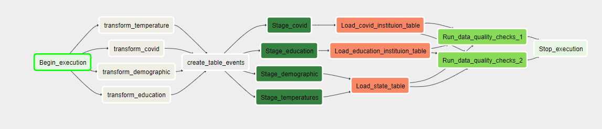

# Introduction

This project consist in a data pipeline that creates a database for analytical purposes about the impact of COVID19 on the different states of the U.S. by evaluating some data about the schools of each state, an estimate of the percentage of people of each race that study in the schools and the temperature of each state to confirm if it spreads better with low temperatures.

It use an S3 Bucket to store the raw and the preprocessed data, a Redshift database where the database is going to be created and apache airflow for the pipeline implementation.

# Datasets

There are six sources of information used to develop our model:

    - **World Temperature Data**: a dataset that combines temperature data from all over the world. We are evaluating the COVID impact by state, therefore, we are going to use the dataset that have this information divided by state. This dataset can be found [here](https://www.kaggle.com/datasets/berkeleyearth/climate-change-earth-surface-temperature-data).
    - **US Schools Dataset**: a dataset that retrieves information about the publics and privates schools of the U.S. This dataset can be found [here](https://www.kaggle.com/datasets/andrewmvd/us-schools-dataset).
    - **US Colleges and Universities**: a dataset similar to the schools dataset that contains some data about the colleges and universities of the U.S. This dataset can be found [here](https://www.kaggle.com/datasets/satoshidatamoto/colleges-and-universities-a-comprehensive-datasee).
    - **COVID-19 in USA**: contains daily data about the evolution of COVID-19 in the U.S. Again, we are using the file that divide this data by state. This dataset can be found [here](https://www.kaggle.com/datasets/sudalairajkumar/covid19-in-usa).
    - **US Cities: Demographics**: contains demographic data of some of the largest US cities. We are going to use this data to estimate the percentage of people of each race. This dataset can be found [here](https://public.opendatasoft.com/explore/dataset/us-cities-demographics/export/).
    - **Annual Population Estimates**: data about the population of each state. This data can be by a request to the this [API](https://api.census.gov/data/2021/pep/population).

# Files of the project

The workspace consist of this files to perform the pipeline:

    - dags/covid_dag.py: the dag that will perform the data pipeline.
    - dags/processing/*.py: this files will be called by the bash operator defined in the dag. They are going to retrieve the raw data from S3, transform the data and load it back to S3.
    - dags/create_tables.sql: sql script that execute drop and create statements.
    - plugins/helpers/sql_queries.py: sql script that retrieve information from the staging tables.
    - plugins/operators/data_quality.py: this operator check if the there are NULL values in the data and if there are numbers below 0.
    - plugins/operators/load_table.py: this operator will insert the data extracted by the sql_queries and insert them in the corresponding table.
    - plugins/operators/stage_redshift.py: this operator is going to copy the data from S3 to some staging tables.
    - dwh.cfg: contains information about the AWS credentials.
    - upload_raw_data.py: script that take the data from the local machine and load it in raw format in S3.
    - edas/*: some basic exploratory data analysis of the datasets.

# Steps of the project

    - 1. Define the scope the project and retrieve datasets.
    - 2. Explore the data.
    - 3. Define the model.
    - 4. Create the ETL process.
    - 5. Explanations of the decisions made in the project.

# 1. Scope the project

The main goal of the project was to analyze the impact of one of the most dangerous virus in the last century. This database aimed to analyst should help them in the search and develop of new strategies in order to deal with new pandemics without paralyzing the whole education system of the U.S.

The technologies used in this project are Amazon S3 for the storage of the raw data and the lake, Amazon Redshift for the storage of the analytical database, Apache Airflow for the data pipeline and Pandas library for the exploratory data analysis and the cleaning process of the dataset.

For that reason, the datasets we have chosen for this project are, for the covid data, the covid-19 in U.S. dataset, for the education data, the public and private schools, colleges and universitiy data, and for the state data, global temperature from the last 50 years by state, percentage of races and total population by state.

# 2. Explore the data

To gain some insight about how this step was done, you can open the python files located in the EDA folder.

In short, this files explain how we have extracted the data, how we analyzed the datasets to know which data is useful for the project and how we have performed some of the data cleaning.

# 3. Model

This is the model we have created for the database:

We have 3 tables with the following data:

- **state**: this is table record some information depmographic and temperature data about the state:
    - id_state (INT8 PRIMARY KEY): identification of the row.
    - name_state (VARCHAR): name of the state.
    - american_native (NUMERIC): percentage of american native people in the state.
    - asian (NUMERIC): percentage of asian people in the state.
    - african_american (NUMERIC): percentage of african_american people in the state.
    - hispanic (NUMERIC): percentage of hispanic people in the state.
    - white (NUMERIC): percentage of white people in the state.
    - population (INT8): total population of the state.
    - avg_temp (NUMERIC): average temperature in celsius for the last 50 years.
    - avg_autumn_temp (NUMERIC): average temperature between january and march for the last 50 years.
    - avg_spring_temp (NUMERIC): average temperature between april and june for the last 50 years.
    - avg_summer_temp (NUMERIC): average temperature between july and september for the last 50 years.
    - avg_winter_temp (NUMERIC): average temperature between october and december for the last 50 years.
- **education**: contains information about the educational institutions of the U.S.:
    - id_institution (INT8 PRIMARY KEY): identification of institution.
    - id_state (INT8 FOREIGN KEY): identification of the state.
    - institution_name (TEXT PRIMARY KEY): name of the institution.
    - city (TEXT PRIMARY KEY): city of the institution.
    - n_students (TEXT PRIMARY KEY): students enrolled at the institution.
    - n_employees (TEXT): employees working in the institution.
    - availability (TEXT): if the institution is public or private or we have no data.
- **covid**: contains daily information about the covid progress in the U.S.:
    - id_covid_data (INT8 PRIMARY KEY): identification of the row.
    - id_state (INT8 FOREIGN KEY): identification of the state.
    - day_date (TEXT): day the data was retrieved.
    - positive (NUMERIC): number of positive people during that day.
    - hospitalized_curr (NUMERIC): number of people who are currently hospitalized.
    - hospitalized_acum (NUMERIC): cumulative people who has been hospitalized.
    - death (NUMERIC): number of deaths of the day.

# 4. Data pipeline

To gain insight about the data pipeline, feel free to explore the dags and plugins folder.

In short, here is the graph view of the data pipeline we have created for this project.

# 5. Project write up

##### What's the goal?

The goal was to analyze the spread of COVID-19 across the state, and study how much impact the school terms and the race had in the spread.

The model could have had 5 tables,the state table with only the id_state to connect all the tables and name, and then, the demographic, temperatures, education and covid tables.

But I think that with this aproach we only have to use two joins instead of four for some cases andnd the impact of doing this is insignificant.

Some of the queries that one could run are:

    - Group by public and private schools and then evaluate how fast the covid spread in that state. Usually there are more people for classroom in the public schools which helps covid-19 to spread.
    - Group by number of professor and availability of the school for the same reason above.
    - Evaluate the average temperature of the season to confirm that the covid 19 transmission is beter in cold seasons.
    - Evaluate the total average temperature to study the differences between colder and warmer states.
    - Group by races to evaluate if one race is more prevalent to report a positive result or a death.
    - Group by population to see if the number of positive number grows faster by proportion.

Also, people could develop a machine learning model with some of the data to predict the likelihood of positives in the school and help teachers create strategies when one person is positive to contain the outbreak without paralyzing the whole school.

##### Choice of tools

    - Pandas: it provides an easy way to extract and manipulate data.
    - Apache airflow: because it allows us to schedule the pipeline and monitor it.
    - S3: because it is highly scalable, reliable and fast.
    - Redshift: because it is cloud-based and provided a flexible architecture that can scale easily.

##### Possible scenarios

    - The data was increased by x100: we will use the functionality that provides amazon and the dag to paralellize the process.
    - The pipelines were run on a daily basis by 7am: we just only need to change the covid_dag.py to update daily the data.
    - The database needed to be accessed by 100+ people: we use some of the tools thats amazon provided us to store the data in different database and let amazon balance the load.

